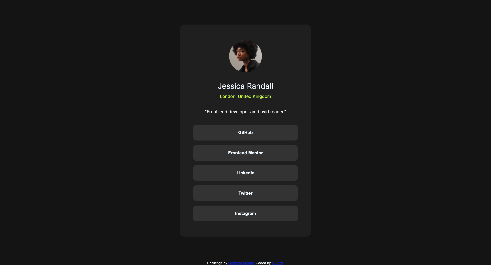

# Frontend Mentor - Social links profile solution

This is a solution to the [Social links profile challenge on Frontend Mentor](https://www.frontendmentor.io/solutions/social-links-profile-SaY6AoX6sh).

## Table of contents

- [Overview](#overview)
  - [The challenge](#the-challenge)
  - [Screenshot](#screenshot)
  - [Links](#links)
- [My process](#my-process)
  - [Built with](#built-with)
  - [What I learned](#what-i-learned)
  - [Continued development](#continued-development)
  - [Useful resources](#useful-resources)
- [Author](#author)
- [Acknowledgments](#acknowledgments)

## Overview

Social links profile

### Screenshot

### Links

- Solution URL: [N1kemi](https://github.com/N1kemi/Social-links-profile)
- Live Site URL: [Website](https://n1kemi.github.io/Social-links-profile/)

## My process

### Built with

- Semantic HTML5 markup
- CSS custom properties
- CSS Grid

### Continued development

- I want to improve my understanding of adaptive layout.
- I also want to improve my English to understand technical documentation more easily.

## Author

- Website - [N1kemi](https://github.com/N1kemi)
- Frontend Mentor - [@ N1kemi](https://www.frontendmentor.io/profile/N1kemi)
- Twitter - [@Ruslan_Bilousov](https://x.com/Ruslan_Bilousov)

## Acknowledgments

I would like to thank the Frontend Mentor team for this project - it helped me practice HTML and CSS.
